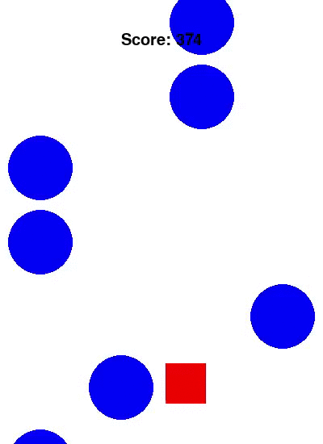

# CUBE AND BALLS
# Reinforcement Learning. Q-Learning.

## Introduction
The task of this project is learn how to create an agent able to play created game using Q-Learning algorithm.
The game (environment) sends to the agent his x position, (x,y) position of second bottom ball and x positions of third and
forth ball. In my opinion this is the best choice of features to track to make Q-Table small enough and train system fast enough (~8 MB).





## Install
This project requires Python 3.6+, Pygame, Numpy and Matplotlib (for progress visualization after game session).

``` bash
git clone https://github.com/flash10042/cube-and-balls.git
```

## Run
To run just a game without an agent type at Terminal:
```
python3 game.py
```
To run game with agent playing it type next command:
```
python3 qlearning.py
```
Agent is already trained and working in 'demo' mode. To train system switch DEMO_MODE value to 0 at line 9 of qlearning.py.
To use new random Q-Table comment line 33 and uncomment line 32 at qlearining.py

Also, you can play around SHOW_EVERY values to see more or less often agent gameplay.

## By The Way
As you can see code of a RNG of a ball spawner is little bit tricky. It is done so that the player doesn't have 100% loss situations
and player can survive in any situation.
